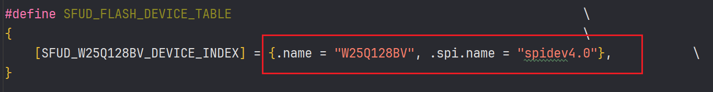
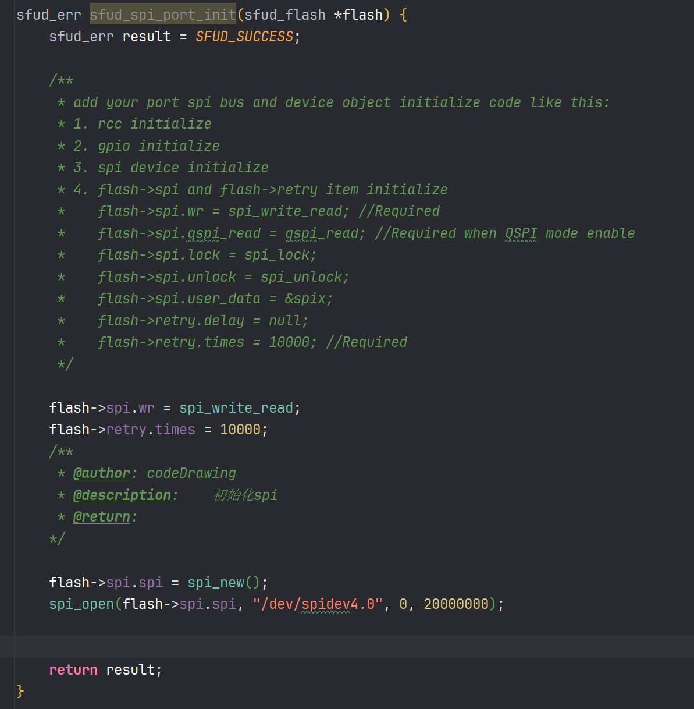
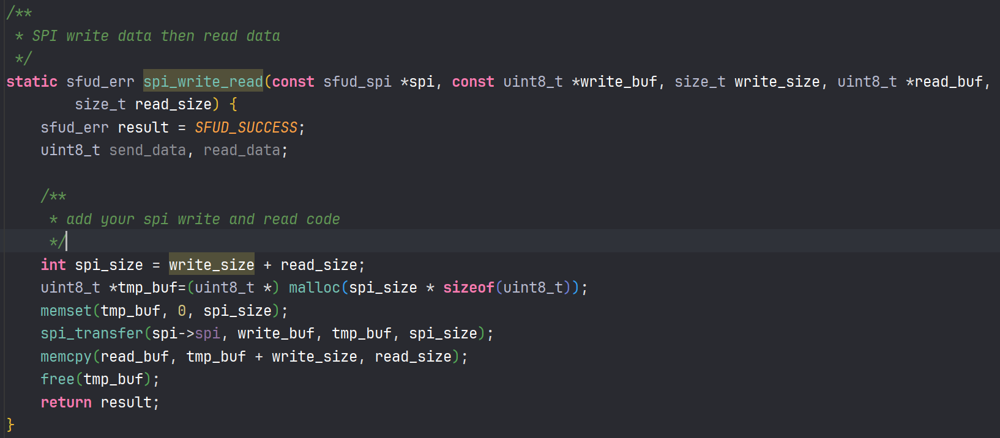

# SFUD测试例程说明
基于c语言，在3588上测试给FPGA升级没有问题。

SFUD是一个开源的操作SPI FLASH的库，他基于SFDP标准开发
## 1. 例程代码说明
两个define `WRITE_SPI_FLASh` 和 `READ_SPI_FLASH_100` 分别表示读和写SPI Flash的数据。
### 初始化
调用 `sfud_init()` 他会自动去找步骤2里面设置的spi flash的型号并且初始化。

`sfud_get_device()` 会根据传入的index的值去返回spi flash设备的指针，这就是需要操作的设备。

### 写
打开一个需要升级的bin文件，然后调用 `sfud_write()` 函数，他会自动的把bin文件写入到spi flash中。
要写入flash需要先擦除，再写入。`sfud_write()`他会自动帮你擦除然后再写入

该库也有其他函数，可以去看`sfud.h`中的声明。
### 读
这里是使用`sfud_read()`函数，他会把spi flash中的数据读取到一个缓冲区中。

同时，这里一次性读取了100个字节数据，应该还可以更多。

## 2. 移植说明
### 修改spi flash型号

上图表示sfud_cfg.h需要修改成目标 spi flash 的型号。
### 实现sfud_spi_port_init函数
在sfud->por->sfud_port.c文件下，需要实现`sfud_spi_port_init()`函数，这个函数是用来初始化spi flash的spi接口的。

函数内部的注释说明了那些是必须要写明的。如下图所示

### 实现spi_write_read函数
这里就需要写spi具体的操作了，SFUD这个库只关心对flash的操作，不关系spi的操作。

所以这里就需要写出自己spi的操作，然后会sfud关于spi的读写会调用这个函数去实现。
